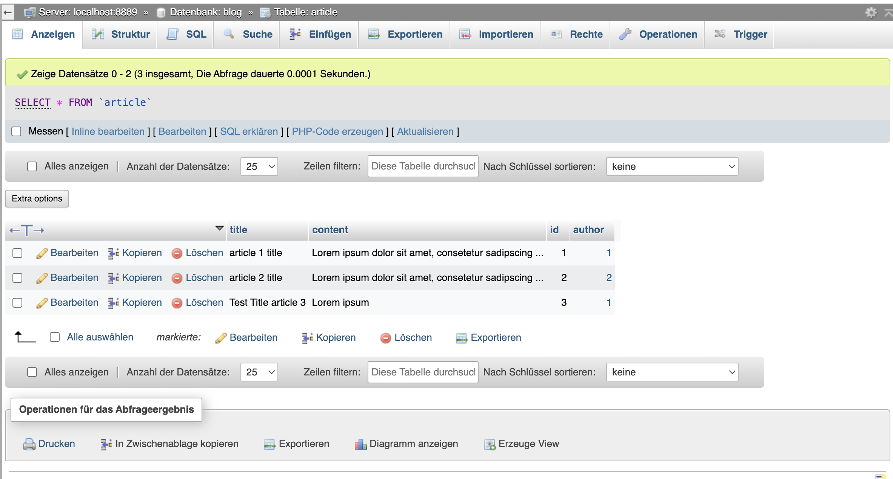
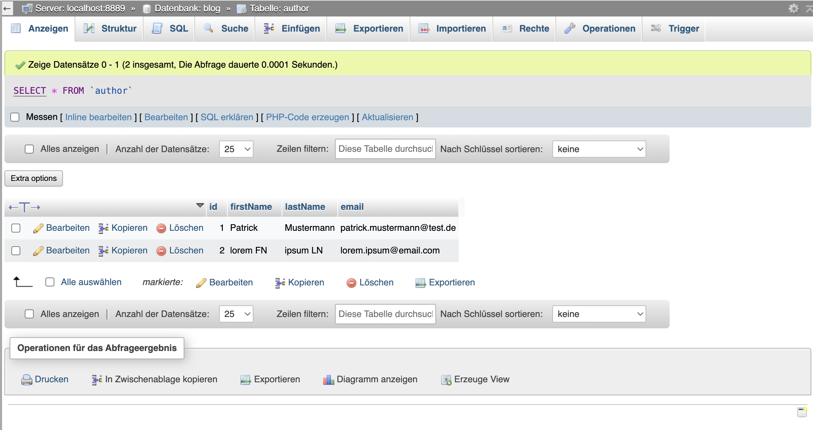
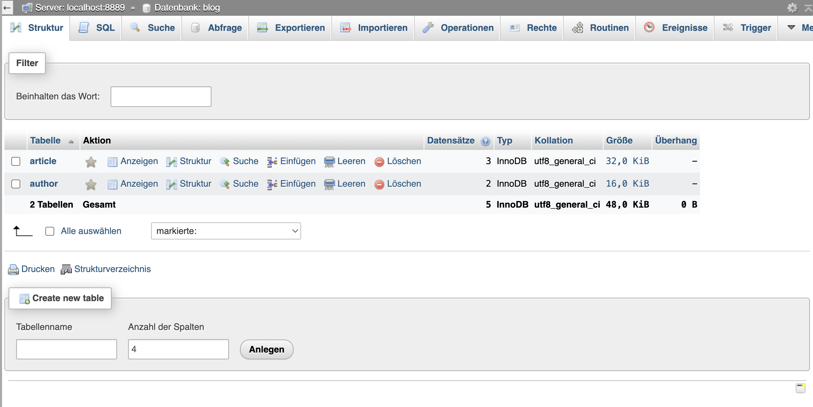
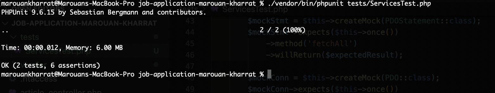
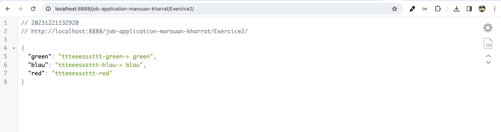
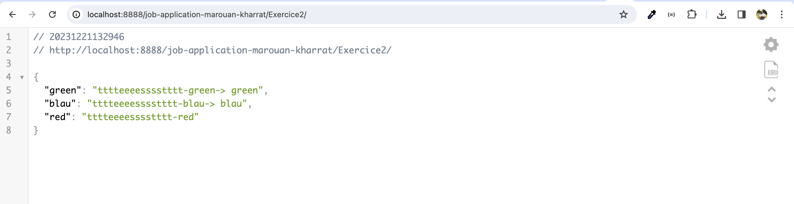

# Antiloop Backend Developer Coding Challenge

The coding challenge has two parts. The first one is about PHP basics on the example of articles and authors. The second exercise is about refactoring existing PHP code.

You can find detailed instructions in the corresponding subfolders:
- [Instructions Exercise 1: PHP basics with articles and authors](exercise-1/Instructions.md)
- [Instructions Exercise 2: PHP code refactoring](exercise-2/Instructions.md)

If you have any questions, please contact us via e-mail or telephone. The time-slot for doing the challenge is 4 hours.

# Add by Marouan Kharrat

You must configure the base url and databse information in config.php and .htaccess

Example: 
$basePath = '/your project directory';
$servername = "localhost:8889";
$username = "blog";
$password = "blog";
$database = "blog";

# Setup project 
composer install --dev
# Unit Tests
./vendor/bin/phpunit tests/ServicesTest.php

## Screenshots

### Article Data

### Author Data

### Database Schema

### Unit Test Result

## Instructions for Exercice 2

Run composer dump-autoload

## Some notes and improvements:

Improved Naming: Renamed the class and methods to align with PSR-12 coding standards for better clarity.

Enhanced Parameter Names: Renamed parameters to provide clearer understanding.

Code Cleanup: Removed redundant code and unnecessary variables for simplicity.

Logic Consolidation: Simplified the logic by eliminating unnecessary loops for example foreach.

Readability Improvements: Organized the code to enhance readability and maintainability.

Encapsulation: Made the reverseAndSplitText method private, as it's only used internally.

## Screenshot Exercice 2
### Result with 3

### Result with 4

